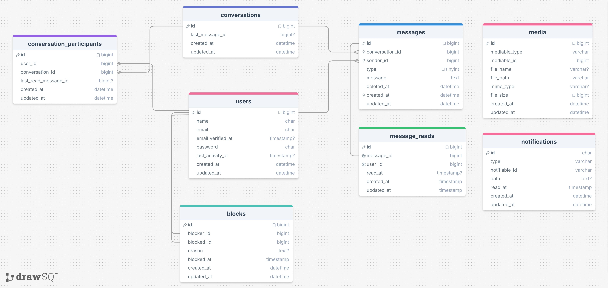
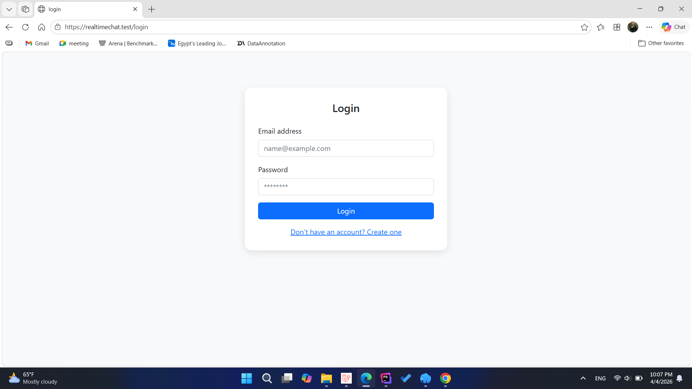
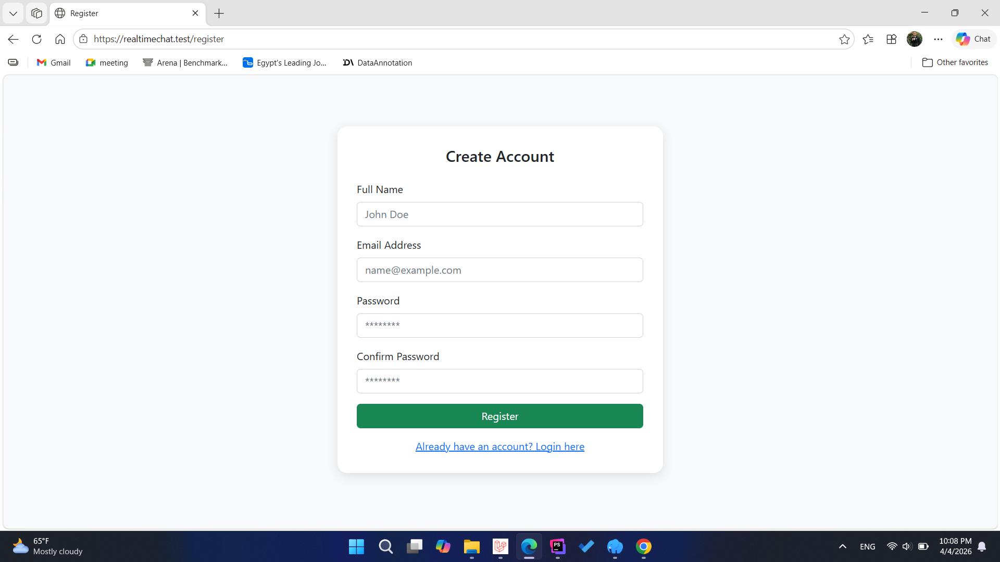
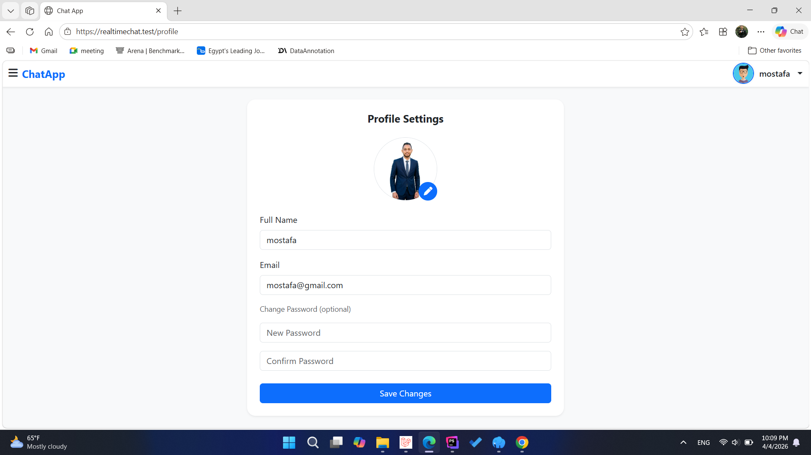
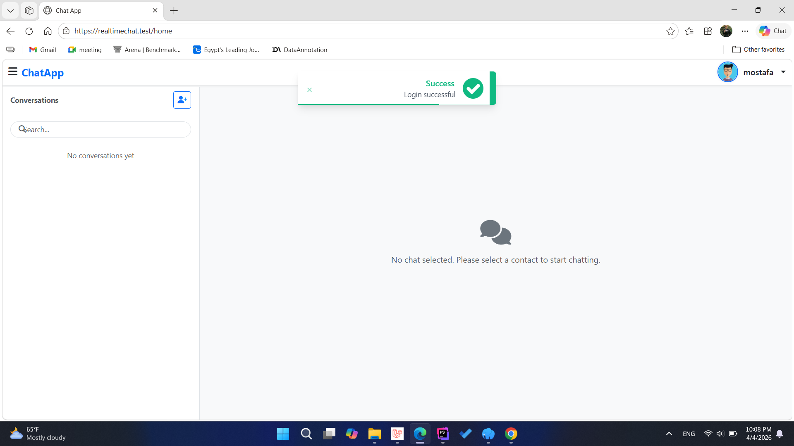
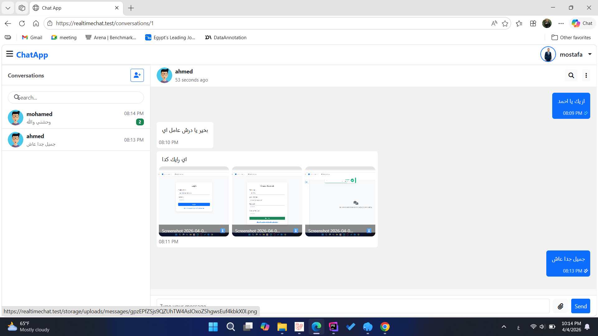
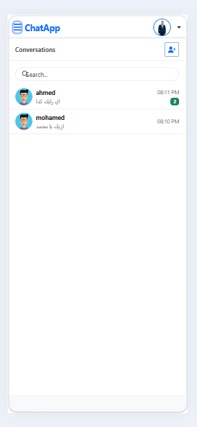
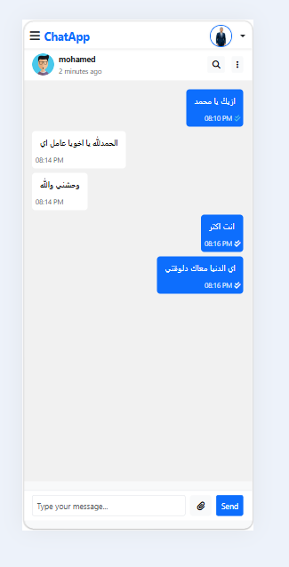
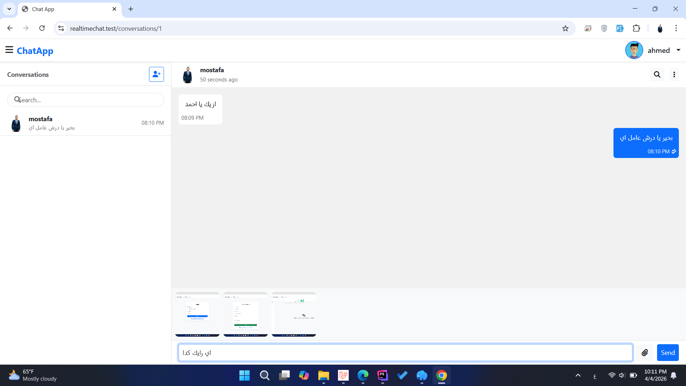

# 💬 RealTimeChat Application

> A modern, real-time chat application built with **Laravel 12**, featuring instant messaging, WhatsApp-style read receipts, media attachments, and infinite scroll pagination with clean service-layer architecture.

**[Overview](#overview) • [Features](#features) • [Architecture](#-architecture) • [Installation](#-installation--setup) • [Usage](#-usage) • [Technologies](#-technologies-used) • [License](#-license)**

---

## Overview

**RealTimeChat** is a production-ready chat application designed to demonstrate modern Laravel best practices. It combines robust backend architecture with an intuitive user interface, enabling real-time conversations with media sharing, read status tracking, and activity monitoring.

### Key Highlights
- ✅ **Service-Layer Architecture**: Clean separation of concerns with dedicated business logic layer
- ✅ **Real-Time Ready**: Laravel Reverb WebSocket infrastructure prepared for live messaging
- ✅ **Read Receipt System**: Dual-table design for efficient unread count tracking
- ✅ **Media Support**: Image, video, and file attachments with polymorphic storage
- ✅ **Infinite Scroll**: Optimized pagination (20 messages per batch)
- ✅ **Security First**: Transaction-safe operations, CSRF protection, input validation

---

## 🚀 Features

### Authentication & User Management
- **Registration** with email validation
- **Login** with session management
- **Profile Management** with avatar upload
- **Last Seen Tracking** for activity indicators
- **Online Status** monitoring across sessions

### Real-Time Messaging
- **Text Messages** with instant delivery
- **Media Attachments** (images, videos, documents)
- **Mixed Content** (text + media in single message)
- **Infinite Scroll** pagination (20 messages per load)
- **Search Conversations** by participant

### Read Status & Activity
- **Read Receipts**: ✓ (sent) • ✓✓ (read) – WhatsApp-style indicators
- **Message Timestamps** for all messages
- **Last Seen Indicator** showing when user was last active
- **Automatic Tracking** of read/unread status per conversation

### User Interface
- **Responsive Design** (Desktop, Tablet, Mobile)
- **Bootstrap 5 Framework** for consistent styling
- **Real-time Toast Notifications** for user feedback
- **Conversation List View** with last message preview
- **Modern Chat Interface** with clean message bubbles

---

## 🏗️ Architecture

### System Design Pattern

```
Request
  ↓
Route (routes/web.php)
  ↓
Middleware [auth, last_activity]
  ↓
Controller (injects Service)
  ↓
Service (business logic)
  ↓
Model (Eloquent relations)
  ↓
Database (MySQL)
```

### Core Components

| Component | Files | Purpose |
|-----------|-------|---------|
| **Services** | `app/Services/{ConversationService,ChatService,AuthService}` | Business logic, transactions, validation |
| **Controllers** | `app/Http/Controllers/` | Route handlers, service injection |
| **Models** | `app/Models/{Conversation,Message,User,Media}` | Eloquent relations, queries |
| **Requests** | `app/Http/Requests/` | Form validation rules |
| **Enums** | `app/Enums/MessageType.php` | Message type constants (TEXT=1, MEDIA=2, TEXT_MEDIA=3) |

### Database Schema

**Key Relationships:**
```
User ←→ Conversation (Many-to-Many)
         ↓
    ConversationParticipant (Junction table with last_read tracking)
         ↓
    Message
         ↓
    Media (Polymorphic - attachable to Message or User)
         ↓
    MessageRead (Audit trail for read events)
```

**Read Tracking Strategy (Dual-Table Approach):**
- **`message_reads` table** - Detailed audit trail of when each user read each message
- **`conversation_participants.last_read_message_id`** - Fast reference for O(1) unread count calculation
- **Formula**: Unread count = `COUNT(messages WHERE id > last_read_message_id AND sender_id != current_user)`

### Entity Relationship Diagram



---

## 📸 Screenshots & UI Gallery

### Authentication Flow
| Login Screen | Registration | Profile Management |
|---|---|---|
|  |  |  |

### Desktop Application
| Home Dashboard | Chat Interface |
|---|---|
|  |  |

### Mobile & Responsive Views
| Conversation List | Chat View | Media Messages |
|---|---|---|
|  |  |  |

---

## 🛠️ Installation & Setup

### Prerequisites
- **PHP** ≥ 8.2
- **Composer** (dependency manager)
- **Node.js** & **npm** (for frontend build)
- **MySQL** 5.7+ or compatible database
- **Git** (optional, for cloning)

### Quick Setup (One Command)
```bash
git clone https://github.com/mostafayehia2002/ChatApp.git
cd ChatApp
composer setup
```

The `composer setup` command automatically:
- Installs PHP dependencies
- Creates `.env` configuration file
- Generates application key
- Runs database migrations
- Installs npm packages
- Builds frontend assets

### Manual Setup (Step-by-Step)

#### 1. Clone Repository
```bash
git clone https://github.com/mostafayehia2002/ChatApp.git
cd ChatApp
```

#### 2. Install Dependencies
```bash
composer install
npm install
```

#### 3. Environment Configuration
```bash
cp .env.example .env
php artisan key:generate
```

#### 4. Configure Database (`.env`)
```env
DB_CONNECTION=mysql
DB_HOST=127.0.0.1
DB_PORT=3306
DB_DATABASE=realtimechat
DB_USERNAME=root
DB_PASSWORD=
```

#### 5. Initialize Database
```bash
php artisan migrate
php artisan storage:link
```

#### 6. Build Frontend Assets
```bash
npm run build
```

#### 7. Verify Installation
```bash
php artisan serve
# Application available at http://localhost:8000
```

---

## 🚀 Usage

### Development Environment

**Start Full Development Stack** (Server + Queue + Vite):
```bash
composer dev
```

This runs three concurrent processes:
- **Laravel Server** (port 8000)
- **Queue Listener** (processes background jobs)
- **Vite Dev Server** (hot module reloading)

**Expected Output:**
```
server: Laravel development server started at http://127.0.0.1:8000
vite: VITE v7.0.7  ready in XXX ms
queue: Processing jobs...
```

### Testing
```bash
composer test
# Runs Pest test suite with config cache clearing
```

### Production Build
```bash
npm run build
php artisan migrate --force
php artisan serve --host=0.0.0.0 --port=8000
```

### Application Workflow

#### 1. **Register New Account**
- Navigate to `/register`
- Enter email, name, and password
- Account activated immediately

#### 2. **Start a Conversation**
- Go to `/home` (conversation dashboard)
- Click "New Conversation"
- Enter recipient's email address
- Send initial message

#### 3. **Send Messages**
- Type message in input field
- Click Send (✓ indicates sent)
- Recipient receives notification
- Mark turns ✓✓ when recipient reads

#### 4. **Attach Media**
- Click attachment/paperclip icon
- Select image, video, or document
- Add optional text caption
- Click Send
- Media displays inline with message

#### 5. **View Profile**
- Click avatar/profile icon
- Update name, email, or profile photo
- Changes saved automatically

#### 6. **Track Activity**
- See "Last seen X minutes ago" below each contact
- Online status updates in real-time
- Timestamp on each message shows exact send time

---


## 📦 Technologies Used

### Backend
- **PHP 8.2+** - Server-side language
- **Laravel 12** - Web framework with Eloquent ORM
- **MySQL 5.7+** - Relational database
- **Laravel Reverb** - WebSocket server (configured, ready for real-time features)

### Frontend
- **Blade** - Server-side templating
- **Bootstrap 5** - CSS framework for responsive UI
- **jQuery & Vanilla JavaScript** - Frontend interactivity
- **Vite** - Modern asset bundler with HMR support
- **AJAX** - Asynchronous requests for infinite scroll

### Development & Testing
- **Pest** - Modern PHP testing framework
- **Faker** - Fixture generation for test data
- **Mockery** - Mocking library for unit tests
- **Laravel Pint** - Code style fixer
- **Laravel Pail** - Log viewer for development

### Utilities
- **php-flasher** - Toast notifications system
- **Laravel Tinker** - REPL for debugging
- **Concurrently** - Run multiple processes in parallel

---


## 🚀 Performance & Optimization

- **Eager Loading**: Relations loaded with `with()` to prevent N+1 queries
- **O(1) Unread Counts**: `last_read_message_id` enables instant unread calculation
- **Pagination**: 20-message batches with infinite scroll prevent memory bloat
- **Database Indexing**: Message queries optimized with `orderByDesc('id')`
- **Asset Bundling**: Vite provides optimized CSS/JS splitting for fast loads

---

## 📄 License

This project is open source and available under the **MIT License**. See the `LICENSE` file for complete details.

---

## 🔮 Future Enhancements

### Planned Features
- 🔄 Typing indicators and "is typing..." status
- ❤️ Message reactions (emoji reactions)
- ✏️ Message editing and deletion with history
- 👥 Group conversations with multiple participants
- 📞 Voice and video calling integration
- 🔐 End-to-end encryption for messages

### Infrastructure Improvements
- 📊 Redis caching layer for session and message caching
- 🔍 Elasticsearch integration for message search
- 🚀 Laravel Forge deployment automation
- 🔄 CI/CD Pipeline (GitHub Actions)
- 📈 Sentry integration for error tracking and monitoring

---

## 📞 Support & Questions

For issues, feature requests, or questions:

- **GitHub Issues**: [Open an Issue](https://github.com/mostafayehia2002/ChatApp/issues)
- **Email**: moustafa.yehia.dev@gmail.com
- **Documentation**: See `AGENTS.md` for AI development guidelines

---

## 🤝 Project Information

- **Repository**: https://github.com/mostafayehia2002/ChatApp
- **Author**: Mostafa Yehia
- **Maintained**: Actively developed and maintained
- **Last Updated**: April 2026

---

**Made with ❤️ using Laravel 12 • [Star on GitHub ⭐](https://github.com/mostafayehia2002/ChatApp)**

