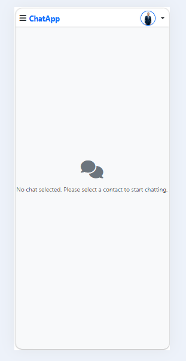

# Real-Time Chat App

A chat application built with **Laravel 12** using a clean architecture based on conversations, messages, media attachments, read status, and last activity tracking.
---

## 🚀 Features

### Authentication
- Register
- Login
- Logout

### Profile
- Update name, email, and password
- Upload profile image

### Chat
- Start conversation using user email
- Send text messages
- Send multiple attachments
- Display images, videos, and files
- Read status (double check like WhatsApp)
- Show last seen
- Load latest 20 messages on open
- Infinite scroll to load older messages
- Search conversations

---

## 🛠 Tech Stack
- **Laravel 12**
- **Blade**
- **Bootstrap 5**
- **jQuery / JavaScript**
- **Laravel Reverb** *(prepared for real-time integration)*
- **MySQL**

---

## 🗂 Database Design

### ERD


---

## 📸 Application Screenshots
### Auth 


### Home Page


### Conversation View in Mobile



### Media Messages


---

## 🔄 Current Frontend Flow

### Home
- Shows sidebar with conversations
- If no conversation is selected, a placeholder appears

### Conversation View
- Chat navbar
- Messages area
- Message form
- Media preview before sending

### Message Loading
- Latest 20 messages are loaded first
- Older messages are loaded when the user scrolls up

---

## ✅ Read Status Logic
- Each opened conversation marks unread messages as read
- `message_reads` stores detailed reads
- `conversation_participants.last_read_message_id` stores the last read message for fast unread count

---

## 🟢 Last Activity
The app uses middleware to update:

- `users.last_activity_at`

This is used for:
- Last seen
- Online/offline logic *(future improvement)*

---

## ⚙️ Installation

```bash
git clone https://github.com/mostafayehia2002/ChatApp.git
cd ChatApp
composer install
npm install
cp .env.example .env
php artisan key:generate
php artisan migrate
php artisan storage:link
php artisan serve
npm run dev
